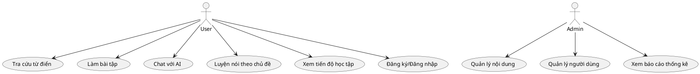
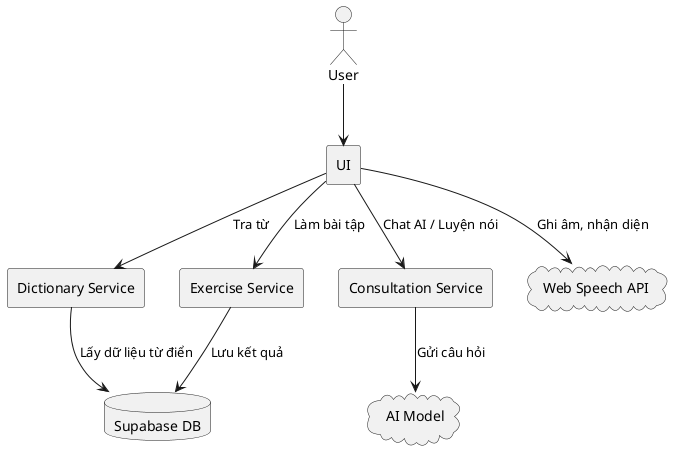
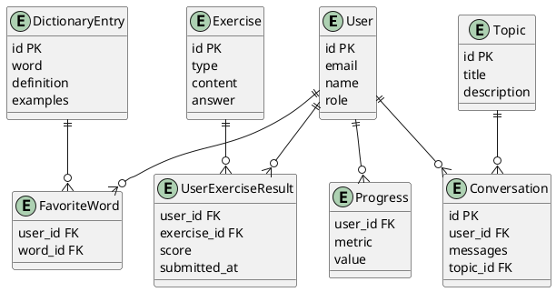

# TÀI LIỆU ĐẶC TẢ YÊU CẦU PHẦN MỀM (SRS)

## 1. GIỚI THIỆU

### 1.1. Mục đích của tài liệu
Tài liệu này mô tả chi tiết các yêu cầu chức năng và phi chức năng cho hệ thống: **EngBuddy - English Learning Platform**. Đây là cơ sở để phát triển, kiểm thử, triển khai và bảo trì hệ thống.

### 1.2. Phạm vi của sản phẩm
- Xây dựng hệ thống **EngBuddy - English Learning Platform**: nền tảng học tiếng Anh tích hợp AI, hỗ trợ tra cứu từ điển, luyện tập, hội thoại, luyện nói và quản lý tiến độ học tập cho người Việt.
- Hệ thống hỗ trợ các vai trò: Người dùng (học viên, giáo viên), Quản trị viên.
- Sản phẩm là một ứng dụng web (SPA), responsive, hoạt động trên các trình duyệt hiện đại và thiết bị di động.

### 1.3. Định nghĩa, từ viết tắt và thuật ngữ
- **EngBuddy**: Nền tảng học tiếng Anh tích hợp AI, giao diện hiện đại, đa thiết bị.
- **Dictionary Module**: Chức năng tra cứu từ điển, ví dụ, phát âm, lưu yêu thích, lịch sử.
- **Exercises Module**: Chức năng tạo, làm, chấm điểm và lưu bài tập tiếng Anh cá nhân hóa.
- **AI Chat Module**: Trợ lý AI hội thoại, giải đáp, hướng dẫn học tập, lưu lịch sử chat.
- **Conversation Topics**: Module luyện nói theo chủ đề, hỗ trợ ghi âm, nhận diện giọng nói, phát âm.
- **User**: Người dùng cuối (học viên, giáo viên, khách truy cập).
- **Admin**: Quản trị viên hệ thống (quản lý nội dung, người dùng, thống kê).
- **Supabase**: Nền tảng backend (database, authentication, API) sử dụng cho dự án.
- **shadcn/ui**: Thư viện UI component hiện đại dùng cho giao diện.
- **React 18**: Framework xây dựng giao diện người dùng.
- **Vite**: Công cụ build và phát triển frontend.
- **TailwindCSS**: Framework CSS tiện dụng cho thiết kế responsive.
- **Speech Recognition**: Công nghệ nhận diện giọng nói (Web Speech API) tích hợp luyện nói.
- **Text-to-Speech (TTS)**: Công nghệ chuyển văn bản thành giọng nói (phát âm AI).
- **SPA**: Single Page Application (ứng dụng web một trang).
- **Responsive**: Giao diện thích ứng mọi thiết bị.

---

## 2. MÔ TẢ TỔNG QUAN

### 2.1. Quan điểm sản phẩm
- Sản phẩm là một hệ thống web độc lập, có thể tích hợp với các dịch vụ bên ngoài (AI API, dịch vụ phát âm, lưu trữ cloud).
- Hệ thống hướng tới người học tiếng Anh Việt Nam, mọi trình độ.

### 2.2. Chức năng sản phẩm
- Tra cứu từ điển, ví dụ, phát âm, lưu yêu thích, lịch sử.
- Làm bài tập tiếng Anh đa dạng, cá nhân hóa, chấm điểm tự động.
- Chat với AI để luyện hội thoại, hỏi đáp, giải thích ngữ pháp.
- Luyện nói theo chủ đề, ghi âm, nhận diện giọng nói, đánh giá phát âm.
- Quản lý người dùng, phân quyền, lưu tiến độ học tập.
- Thống kê, báo cáo tiến độ học tập.

### 2.3. Đặc điểm người dùng
- Người học tiếng Anh (mọi trình độ), giáo viên, quản trị viên.
- Có thể truy cập hệ thống từ máy tính, điện thoại, máy tính bảng.

### 2.4. Ràng buộc
- Hệ thống phải tuân thủ các quy định về bảo mật dữ liệu cá nhân.
- Giao diện hỗ trợ tiếng Việt và tiếng Anh.
- Thời gian phản hồi < 2 giây cho các thao tác chính.

### 2.5. Giả định và phụ thuộc
- Người dùng có kết nối Internet ổn định.
- Hệ thống sử dụng dịch vụ xác thực bên ngoài (Supabase Auth, Google, Facebook) nếu cần.

---

## 3. YÊU CẦU CỤ THỂ

### 3.1. Yêu cầu chức năng

#### 3.1.1. Từ điển thông minh (Dictionary Module)
- **Mô tả:** Tra cứu từ vựng tiếng Anh, hiển thị nghĩa, ví dụ, phát âm, lưu yêu thích, lịch sử.
- **Đầu vào:** Từ khóa tiếng Anh.
- **Đầu ra:** Định nghĩa, ví dụ, phát âm, gợi ý từ liên quan.
- **Quy tắc nghiệp vụ:** Không lưu trùng từ trong danh sách yêu thích.

#### 3.1.2. Bài tập cá nhân hóa (Exercises Module)
- **Mô tả:** Tạo, làm, chấm điểm bài tập tiếng Anh đa dạng (12 loại), lưu tiến độ.
- **Đầu vào:** Chủ đề, loại bài tập, đáp án người dùng.
- **Đầu ra:** Kết quả chấm điểm, phân tích, gợi ý cải thiện.
- **Quy tắc nghiệp vụ:** Không cho phép làm lại bài tập đã hoàn thành (nếu cấu hình).

#### 3.1.3. Chat với AI (AI Chat Module)
- **Mô tả:** Trò chuyện với AI, hỏi đáp, giải thích ngữ pháp, lưu lịch sử chat.
- **Đầu vào:** Tin nhắn người dùng.
- **Đầu ra:** Phản hồi AI, gợi ý học tập.
- **Quy tắc nghiệp vụ:** Lưu tối đa 1000 tin nhắn gần nhất.

#### 3.1.4. Chủ đề hội thoại (Conversation Topics)
- **Mô tả:** Luyện nói theo chủ đề, ghi âm, nhận diện giọng nói, phát âm, đánh giá.
- **Đầu vào:** Chủ đề, câu hỏi, ghi âm giọng nói.
- **Đầu ra:** Đánh giá phát âm, phản hồi AI, tiến độ luyện nói.
- **Quy tắc nghiệp vụ:** Chỉ lưu bản ghi âm cuối cùng cho mỗi chủ đề.

#### 3.1.5. Quản lý người dùng (User Management)
- **Mô tả:** Đăng ký, đăng nhập, phân quyền, cập nhật thông tin cá nhân.
- **Đầu vào:** Thông tin đăng ký, đăng nhập, cập nhật.
- **Đầu ra:** Thông báo xác nhận, danh sách người dùng.
- **Quy tắc nghiệp vụ:** Một email chỉ được đăng ký một tài khoản.

#### 3.1.6. Yêu thích & Lịch sử
- **Mô tả:** Lưu từ vựng yêu thích, lịch sử tra cứu, lịch sử bài tập, lịch sử chat.
- **Đầu vào:** Hành động lưu/xóa yêu thích, thực hiện tra cứu/làm bài/chat.
- **Đầu ra:** Danh sách yêu thích, lịch sử.
- **Quy tắc nghiệp vụ:** Không lưu trùng, cho phép xóa từng mục.

#### 3.1.7. Thống kê & tiến độ học tập
- **Mô tả:** Thống kê số từ đã học, số bài tập đã hoàn thành, tiến độ luyện nói.
- **Đầu vào:** Dữ liệu học tập.
- **Đầu ra:** Báo cáo, biểu đồ tiến độ.
- **Quy tắc nghiệp vụ:** Chỉ người dùng và admin được xem tiến độ cá nhân.

### 3.2. Yêu cầu phi chức năng

- **Hiệu suất:** Thời gian phản hồi < 2 giây cho thao tác chính, hỗ trợ tối thiểu 1000 người dùng đồng thời.
- **Bảo mật:** Mã hóa dữ liệu nhạy cảm, phân quyền truy cập, lưu nhật ký truy cập.
- **Khả năng sử dụng:** Giao diện thân thiện, đa thiết bị, đa trình duyệt, có hướng dẫn sử dụng.
- **Khả năng mở rộng:** Dễ dàng bổ sung module mới, kiến trúc module hóa.
- **Tính khả dụng:** Uptime ≥ 99.5%, có cơ chế backup và phục hồi dữ liệu.
- **UI/UX:** Thiết kế hiện đại, màu sắc hài hòa (chủ đạo: hồng), hỗ trợ dark mode, responsive.
- **Hệ thống:** Hỗ trợ Windows, macOS, Linux, Android, iOS; Chrome, Firefox, Edge, Safari bản mới nhất.

---

## 4. USE CASES / USER STORIES

- **Tra cứu từ điển:** Là một người học, tôi muốn tra cứu nghĩa, ví dụ, phát âm của từ tiếng Anh để hiểu và ghi nhớ từ mới hiệu quả.
- **Làm bài tập:** Là một người học, tôi muốn làm các bài tập đa dạng, được chấm điểm tự động để luyện tập và kiểm tra trình độ.
- **Chat với AI:** Là một người học, tôi muốn trò chuyện với AI để hỏi đáp, luyện hội thoại, giải thích ngữ pháp để cải thiện kỹ năng giao tiếp.
- **Luyện nói theo chủ đề:** Là một người học, tôi muốn luyện nói theo các chủ đề thực tế, ghi âm, nhận phản hồi AI để nâng cao kỹ năng phát âm.
- **Quản lý tài khoản:** Là một người dùng, tôi muốn đăng ký, đăng nhập, cập nhật thông tin cá nhân để lưu tiến độ học tập.
- **Quản trị hệ thống:** Là một admin, tôi muốn quản lý nội dung, người dùng, xem báo cáo để đảm bảo hệ thống vận hành ổn định.

---

## 5. MÔ HÌNH HÓA YÊU CẦU (SƠ ĐỒ)

### 5.1. Sơ đồ Use Case (PlantUML)

### 5.2. Sơ đồ luồng dữ liệu (DFD - Level 1)

### 5.3. Sơ đồ ERD (Mô hình dữ liệu)

---

**Tài liệu này phản ánh đầy đủ các chức năng, nghiệp vụ và kiến trúc thực tế của dự án EngBuddy. Nếu bạn bổ sung module mới hoặc thay đổi logic, hãy cập nhật lại các phần liên quan cho đồng bộ.**
